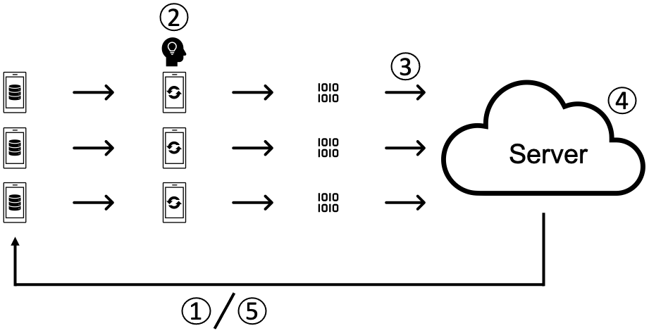
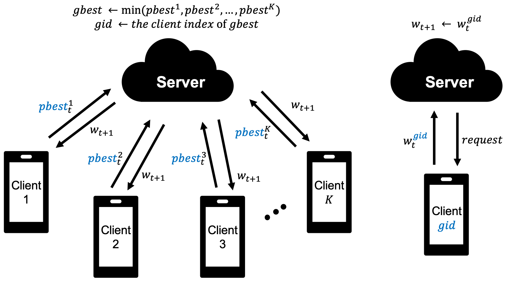
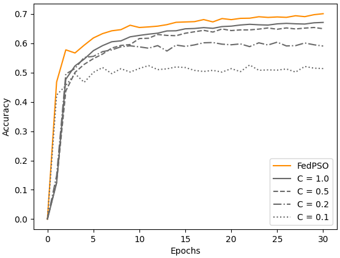
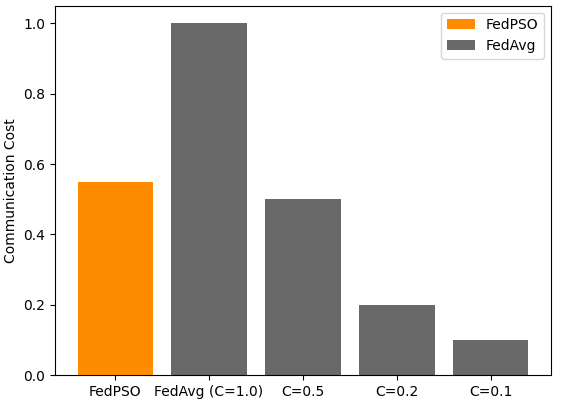
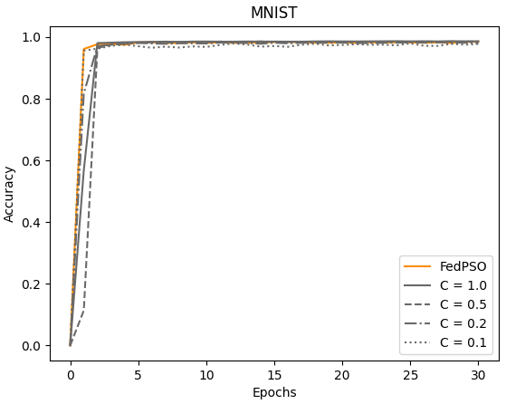
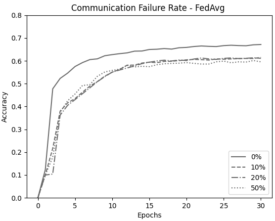
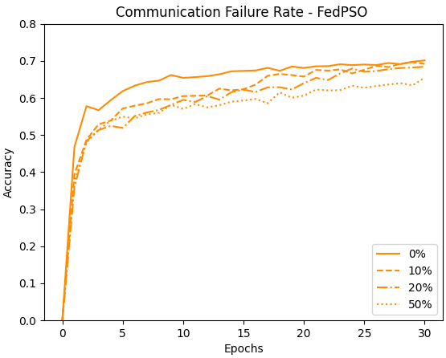

## FedPSO: Federated Learning Using Particle Swarm Optimization to Reduce Communication Costs

## Abstract
Federated learning is a learning method that collects only learned models on a server to ensure data privacy. This method does not collect data on the server but instead proceeds with data directly from distributed clients. Because federated learning clients often have limited communication bandwidth, communication between servers and clients should be optimized to improve performance. Federated learning clients often use Wi-Fi and have to communicate in unstable network environments. However, as existing federated learning aggregation algorithms transmit and receive a large amount of weights, accuracy is significantly reduced in unstable network environments. 
In this study, we propose the algorithm using particle swarm optimization algorithm instead of FedAvg, which updates the global model by collecting weights of learned models that were mainly used in federated learning. The algorithm is named as federated particle swarm optimization (FedPSO), and we increase its robustness in unstable network environments by transmitting score values rather than large weights. Thus, we propose a FedPSO, a global model update algorithm with improved network communication performance, by changing the form of the data that clients transmit to servers. This study showed that applying FedPSO significantly reduced the amount of data used in network communication and improved the accuracy of the global model by an average of 9.47%. Moreover, it showed an improvement in loss of accuracy by approximately 4% in experiments on an unstable network.


## Usage
Download FedPSO Docker image
```shell
docker pull tjdghks994/fedpso
```

Check docker-compose.yaml
- if you want to test FedPSO, please comment on fedAvg.

Example:
```docker
version: '3' 

services: 
    # fedAvg: 
    #     image: tjdghks994/fedpso
    #     network_mode: host
    #     volumes: 
    #     - .:/fl
    #     command: bash -c "sleep 1; python /fl/FedPSO/fed_avg.py"
    
    fedPSO:
        image: tjdghks994/fedpso
        network_mode: host
        volumes: 
        - .:/fl
        command: bash -c "sleep 1; python /fl/FedPSO/fed_pso.py"
```

Run test:
```shell
docker-compose up
```

If you don't use docker images, run it in the following way.
```shell
python -m pip install --upgrade pip
python -m pip install -r requirements.txt

python FedPSO/fed_pso.py
```

## Figure

</img>

Figure 1. Federated Learning Protocol

</img>

Figure 2. The weighted aggregation process of Federated Learning (such as FedAvg) obtains the average of the w_t value received from the client of K from the server and sends the updated w_(t+1) back to the client.

</img>

Figure 3. The weight update process of FedPSO; the server receives a client's score and requests a learning model from the client who submits the optimal value to set it as a global model.

</img>

Figure 4. Accuracy comparison of several algorithm

</img>

Figure 5. Communication Cost comparison of several algorithm

</img>

Figure 6. Comparison of learning accuracy using MNIST

</img>

Figure 7. Comparison of FedAvg(C=1.0) test accuracy in unstable network conditions 

</img>

Figure 8. Comparison of FedPSO test accuracy in unstable network conditions
